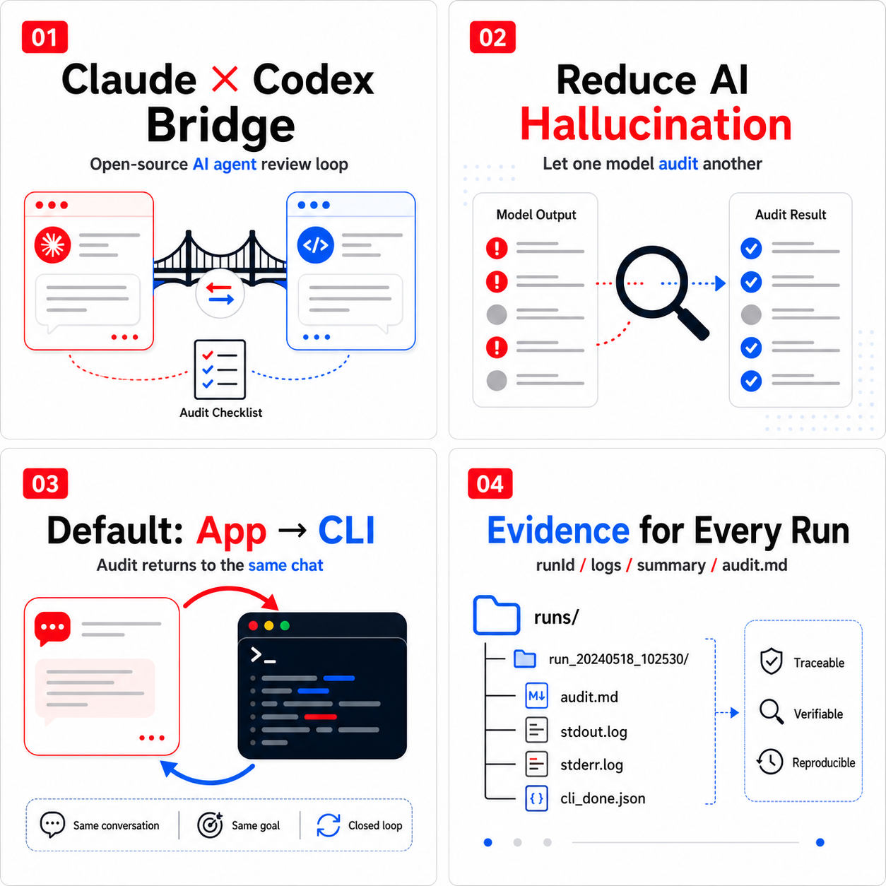

# Claude-Codex Bridge

中文介绍: [README.zh-CN.md](README.zh-CN.md)



Claude-Codex Bridge is an open-source audit and verification bridge for Claude
Code and Codex. It lets one agent review another agent's work, helping reduce
model hallucination, missing evidence, unverified "done" claims, and overlooked
edge cases.

It supports:

- Claude execution -> Codex audit.
- Codex execution -> Claude audit.
- App to CLI: the default mode. Stay in the same Claude/Codex conversation,
  invoke the other agent through its CLI, and receive the audit result back in
  the current conversation.
- App to App: optional desktop App delivery modes for specialized workflows.
- CLI to CLI: scriptable command-line review loops for automation and
  engineering validation.

The recommended default is App to CLI because it does not depend on desktop
window focus, manual send buttons, or new conversations.

## Why This Exists

Claude Code and Codex are both capable coding agents, but complex agentic tasks
still fail in familiar ways:

- The agent says the task is complete without running verification.
- Files are changed, but edge cases or rollback paths are missed.
- Failed commands are hidden or summarized too optimistically.
- The final answer claims more certainty than the evidence supports.
- Long multi-step work produces hallucinated status summaries.

Claude-Codex Bridge turns second-model review into a repeatable workflow instead
of a manual copy-paste ritual.

## Default Workflow

When you work in Claude Code:

```text
Claude current conversation
  -> package the latest work as a handoff
  -> call Codex CLI
  -> Codex audits the result
  -> audit returns to the same Claude conversation
```

When you work in Codex:

```text
Codex current conversation
  -> package the latest work as a handoff
  -> call Claude CLI
  -> Claude audits the result
  -> audit returns to the same Codex conversation
```

No App switching is required for the default CLI path.

## Highlights

- Open-source under the MIT License.
- Bidirectional Claude/Codex second-opinion review.
- App-to-CLI by default, with optional App-to-App modes.
- Same-conversation audit return when using the CLI path.
- Durable run evidence under `.agent-bridge/runs/<runId>/`.
- Streamed stdout/stderr logs to avoid child-process buffer failures.
- `doctor` command for CLI/auth checks and installation guidance.
- No runtime npm dependencies.

## Installation

```bash
git clone https://github.com/Jayden-X-L/claude-codex-bridge.git
cd claude-codex-bridge
npm run check
node agent-bridge/bridge.mjs doctor
node agent-bridge/install-global.mjs
```

Restart Claude Code and Codex after installation so they discover the skill and
plugin.

## Prerequisites

- macOS.
- Node.js 18 or newer.
- Claude Code CLI.
- Codex CLI, or Codex Desktop with its bundled CLI.

If you are not sure whether your machine is ready, run:

```bash
node ~/.agent-bridge/bridge.mjs doctor
```

`doctor` checks:

- Node.js.
- Bridge runtime.
- Codex CLI from `AGENT_BRIDGE_CODEX_BIN`.
- Codex CLI from `PATH`.
- Codex Desktop bundled CLI at:

```text
/Applications/Codex.app/Contents/Resources/codex
```

- Claude CLI.
- Claude auth via `claude auth status`.

If something is missing, it prints the next command to run.

Common fixes:

```bash
npm install -g @openai/codex
npm install -g @anthropic-ai/claude-code
claude auth login
claude auth status
```

## Usage From Claude

In Claude Code, ask:

```text
Use claude-codex-bridge to send this work to Codex for audit.
```

Claude packages the current work, calls Codex CLI, and receives Codex's audit
back in the same conversation.

## Usage From Codex

In Codex, ask:

```text
Use claude-codex-bridge to send this work to Claude for audit.
```

Codex packages the current work, calls Claude CLI, and receives Claude's audit
back in the same conversation.

## Manual Tests

Claude -> Codex audit:

```bash
printf 'Claude result to audit' | node agent-bridge/bridge.mjs to-codex --stdin --delivery cli
```

Codex -> Claude audit:

```bash
printf 'Codex result to audit' | node agent-bridge/bridge.mjs to-claude --mode audit-codex --stdin --delivery cli
```

Dry run without calling a model:

```bash
printf 'handoff preview' | node agent-bridge/bridge.mjs to-codex --stdin --dry-run
```

## Delivery Modes

Default mode:

```bash
--delivery cli
```

This invokes the target agent through its CLI and returns the audit to the
current conversation.

Optional desktop App modes:

```bash
--delivery current
--delivery new
--delivery ax
```

These modes can paste into the current App conversation, open a new App
conversation, or use macOS Accessibility automation. They may require macOS
permissions and are less reliable than the CLI path.

## Run Evidence

Every CLI run gets a `runId` and a durable evidence directory:

```text
.agent-bridge/runs/<runId>/
  handoff.md
  audit.md
  stdout.log
  stderr.log
  summary.json
  summary.md
  cli_done.json or bridge_error.json
```

Use:

```bash
cat .agent-bridge/runs/latest.json
```

to inspect the latest run.

Interpretation:

- `status: success` and `cli_done.json` exists: the audit completed.
- `status: error` and `bridge_error.json` exists: the audit failed, and the
  error was recorded.
- `status: started`: the run is still in progress or was interrupted.

The legacy latest files are also maintained:

```text
.agent-bridge/outbox/latest-codex-audit.md
.agent-bridge/outbox/latest-claude-audit.md
```

## Who This Is For

This project is useful if you:

- Regularly use Claude Code and Codex for non-trivial engineering tasks.
- Want a second model to challenge the first model's output.
- Want fewer hallucinated success summaries.
- Want missing verification, failed commands, and residual risk called out.
- Want each review round to leave local evidence that can be inspected later.

## What This Is Not

This is not a full multi-agent runtime.

It does not replace human judgment, tests, or code review. It standardizes the
handoff between Claude and Codex, asks for a structured second opinion, and keeps
evidence for each run.

## Documentation

- Runtime details: [agent-bridge/README.md](agent-bridge/README.md)
- Contributing: [CONTRIBUTING.md](CONTRIBUTING.md)
- Security: [SECURITY.md](SECURITY.md)
- Changelog: [CHANGELOG.md](CHANGELOG.md)
- Publishing checklist: [PUBLISHING.md](PUBLISHING.md)

## License

MIT License. See [LICENSE](LICENSE).
